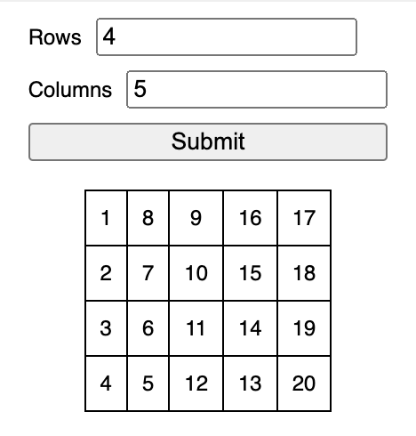

# Generate Table

Generate a table of numbers given the rows and columns.

Generated table of 4 by 5 columns

The user enters the number of rows and columns in a form.
When the form is submitted, a table with the respective number of rows and columns will be generated.
The table contains rows x columns cells, each containing a number sequence from 1 to (rows x columns).